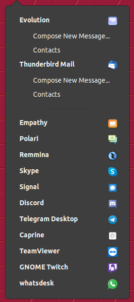

# Messaging Menu

A Messaging Menu for the Gnome Shell. All email, chat, and microblogging
applications in one place.



This extension provides a convenience list of all installed email, chat and
microblogging applications with short cut actions like "Contacts" and "Compose
New Message" for email applications. The icon lights up when you receive
notifications from the listed applications, so you won't miss another message.

The extension's preferences allow you to configure which types of applications
(email / chat / microblogging) you would like to receive notifications for and
which colour the icon should change to, to indicate notification.

Read [here](http://screenfreeze.net/messaging-menu-for-gnome-3/) for why this
extension was created.

Originally forked from https://github.com/screenfreeze/messagingmenu

## Installation

### The easy way (recommended):
One-click install from [extensions.gnome.org](https://extensions.gnome.org/extension/2896/messaging-menu/)!

### Download latest release
1. Download the zip file from the [release page](https://github.com/ChrisLauinger77/messagingmenu/releases/latest)
2. The md5 and sig files can be used to verify the integrity of the zip file
3. Open `gnome-tweak-tool`, go to "Shell Extensions", "Install Extension" and select the zip file.

### Compile from source
Use the `master` branch.

```bash
git clone https://github.com/ChrisLauinger77/messagingmenu.git
cd messagingmenu.git
make install # compile locales, schemas and install locally
# enable messagingmenu if you haven't already:
gnome-shell-extension-tool -e messagingmenu@lauinger-clan.de
```

Now restart gnome-shell.

## Developing

You can get the source code following the [above steps](#compile-from-source).
Unless you're developing for an older gnome-shell version, use the master
branch. If you're using vim, please use `:set noexpandtab` to keep the tabs
indentation. Translation files go in [po](po) and are based on [a
template](po/gnome-shell-extension.pot). There are several `make` targets to
assist development:

  * With no arguments `make` cleans then recompiles the schemas & locales
  * `prod` does the above, then zips it, hashes it and signs it
  * `install` does the above, then extracts the zip to the install location
  * `uninstall` removes the above-installed files

## License
Copyright (C) 2012 Andreas Wilhelm, see [LICENSE.txt](LICENSE.txt) for details

This program is free software; you can redistribute it and/or modify
it under the terms of the GNU General Public License as published by
the Free Software Foundation; either version 2 of the License, or
(at your option) any later version.

This program is distributed in the hope that it will be useful,
but WITHOUT ANY WARRANTY; without even the implied warranty of
MERCHANTABILITY or FITNESS FOR A PARTICULAR PURPOSE.  See the
GNU General Public License for more details.

You should have received a copy of the GNU General Public License along
with this program; if not, write to the Free Software Foundation, Inc.,
51 Franklin Street, Fifth Floor, Boston, MA 02110-1301 USA.
